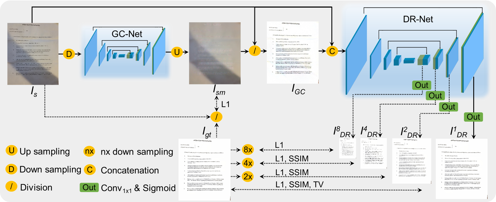

<p align="center">
  
</p>

# GCDRNet 
This repository contains the inference code for our paper [**Appearance Enhancement for Camera-captured Document Images in the Wild**](https://1drv.ms/b/s!Ak15mSdV3Wy4iYkkQw4Jx8RvrV8bNg?e=dqFmZe), which has been accepted for IEEE Transactions on Artificial Intelligence.


## Inference (model weights can be downloaded [here](https://1drv.ms/f/s!Ak15mSdV3Wy4iYkeUK0TYUAajBPaBQ?e=BzXbk3))
Place the distorted image in the folder `./distorted`, run the following command, and the results will be saved in the folder `./enhanced`.
```
python infer.py
```


## RealDAE 
RealDAE (**Real**-world **D**ocument Image **A**ppearance **E**nhancement) is a real-world dataset designed explicitly for camera-captured document images in the wild. It containes 600 pairs of degraded camera-captured document images and corresponding manually enhanced ground-truths (aligned at the pixel level). It can be downloaded [here](https://1drv.ms/u/s!Ak15mSdV3Wy4iYh8iqUs0tOb4rJpzw?e=m0XBCJ
). Some examples are illustrated as below.
<p align="center">
  
</p>

## Citation
If you are using our code and data, please cite our paper.
```
@article{zhang2023appearance,
title={Appearance Enhancement for Camera-captured Document Images in the Wild},
author={Zhang, Jiaxin and Liang, Lingyu and Ding, Kai and Guo, Fengjun and Jin, Lianwen},
journal={IEEE Transactions on Artificial Intelligence},
year={2023}}
```